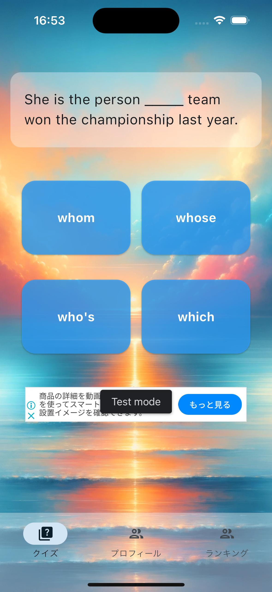
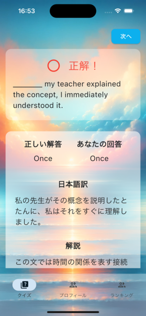
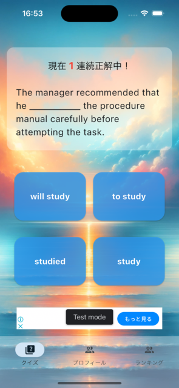
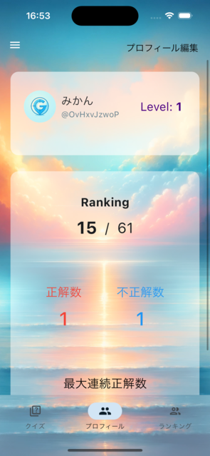
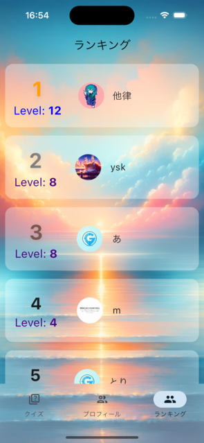

# Gramin
[App Store](https://apps.apple.com/jp/app/gramin-%E3%82%B2%E3%83%BC%E3%83%A0%E6%84%9F%E8%A6%9A%E3%81%A7%E8%8B%B1%E8%AA%9E%E3%81%AE%E6%96%87%E6%B3%95%E3%82%92%E5%8B%89%E5%BC%B7%E3%81%A7%E3%81%8D%E3%82%8B/id6499072709)
  
[Google Play](https://play.google.com/store/apps/details?id=app.yskuem.gramin)

 

## アプリ内容
英語の文法をゲーム感覚で学習する目的で制作したアプリ
 

## 機能
- OpenAIのAPIを使用して無限に新しい英文法問題を作成する機能
- 文法問題の正誤によってポイントが上下する機能（正解したら+2、不正解だと-1、連続で問題に正解すると連続正解数のポイントが付与される)
- ポイントによってユーザーのランキングを出す機能

## 主なコード内容
[Moble](https://github.com/yskuem/Gramin/tree/main/client/mobile/lib)
  
[Backend](https://github.com/yskuem/Gramin/tree/main/server)
 

## 主な使用技術
### モバイル
Flutter、Riverpod、Retrofit、Go Router、Freezed、SharedPreferences
 
### バックエンド
FastAPI、OpenAI API、Docker、CloudRun
 
### データベース、認証
Firestore、Firebase Auth
 
### 広告
Admob
 
### その他
Firebase Analytics、Firebase Remote Config
 
 
## 今後実装したいこと
- 他ユーザーと英文法クイズの早押し対決ができる機能
- 広告を見たら選択肢を絞れる機能
- 問題の難易度の調整機能
- 問題のコメント機能
- テストコードを書くこと
- CI、CDパイプラインを構築すること

## 画面

